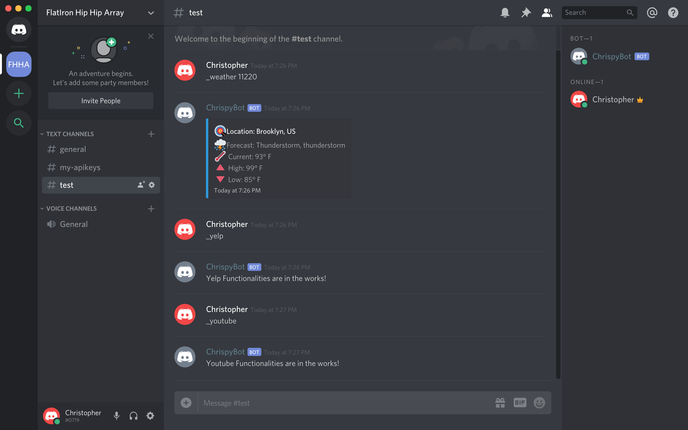

# ChrispyBot
A [Discord](https://discordapp.com/) Utility Bot written in JavaScript using the Discord.js library and Discord Developer tool.

## Introduction
ChrispyBot is a bot made by Discord Developer Tools with all its functionalities written in JavaScript using the Discord.js library. It is intended to give utility to all users in a Discord chat channel such as responding to user typed commands that can get the current weather or search for a youtube video or even find a restaurant.

## Table of Contents
1. [Technologies](#technologies)
2. [Setup](#setup)
3. [Instructions](#instructions)
4. [Example](#example)
5. [To Do](#todo)

## Technologies<a name="technologies"></a>
This project is created using: 
* JavaScript
* [Discord.js](https://discord.js.org/#/) - Object-oreiented based library created with functions that interact with the Discord API.

## Setup / Startup (locally) <a name="setup"></a>
To run this project locally, while in the project directory run
```
npm install && node chrispybot.js
```
*Note: You must have a bot registered with Discord Developer Tools with a token in order to use this project. For information on how to create and register a bot with Discord, take a look at my [blog post](https://medium.com/@christophertruongm/my-discord-bot-project-with-discord-js-248e540c0bea).*

## Instructions <a name="instructions"></a>

### Current Functionalities:

|Function| Example Chat Input |
|-|-|
| Get current Weather | _weather *zipcode* (example: _weather 11220) |

## Examples <a name="example"></a>

#### [Demo Video](https://youtu.be/L_vPl_6cYd4)




## To Do <a name="todo"></a>
* Add Music Playing function with full playlist and music player capabilities via Youtube API.
* Add restaurant finding function via Yelp Fusion API.
